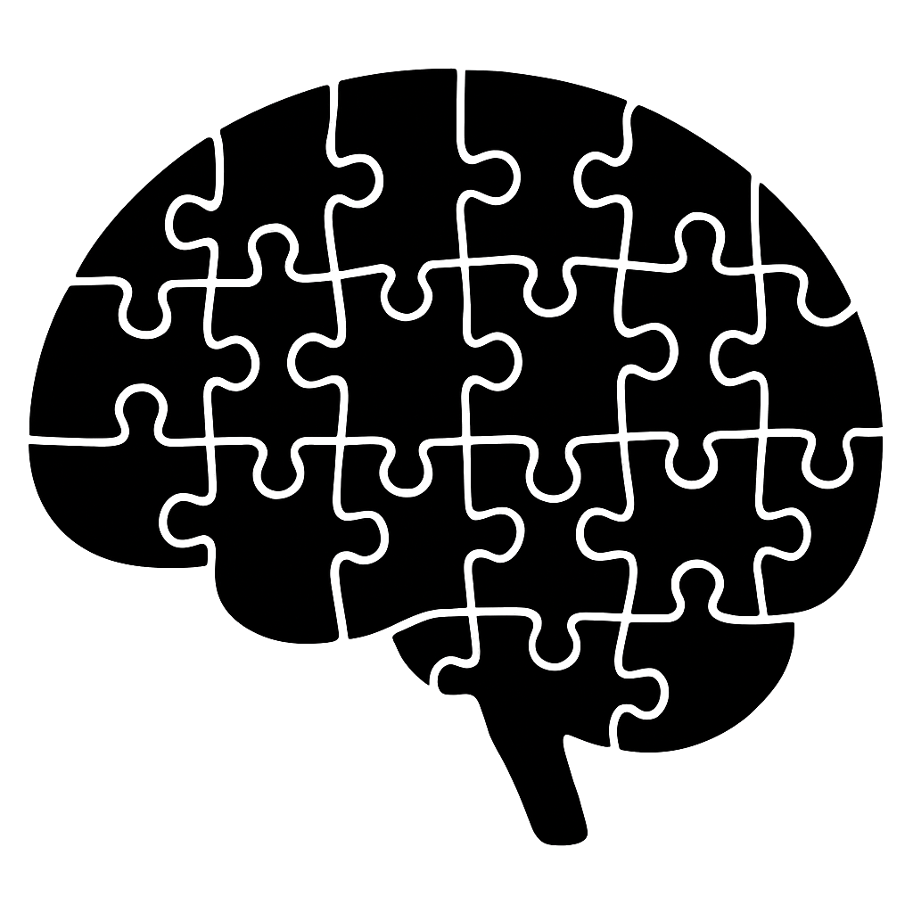

Educating neurodiverse learners has become an important focus in modern classrooms as awareness grows that students think and learn in many different ways. Neurodiversity refers to the natural variation in how human brains are wired and how they function. People whose neurological development and traits align with societal expectations are often called neurotypical. Meanwhile [neurodivergent](https://my.clevelandclinic.org/health/symptoms/23154-neurodivergent) individuals have brains that function differently, leading to unique strengths and challenges. The term neurodivergent is not a medical label but a way to describe these differences without pathologizing them. In a neurodiverse paradigm, conditions like ASD, ADHD, dyslexia, or other cognitive differences are seen not as a medical disorders to cure but as part of human diversity. However, neurodivergent individual needs differ, posing a significant difficulty in the normative modern educational system. 

This article should help instructors understand how to make their curriculum more accessible to neurodivergent students. At start, there is an overview with prevalence to get a sense of the various types and how frequently they appear. ADHD and Autism will be explored in greater detail. Finally, we investigate various techniques for making it easier for certain groups to succeed in the educational system.

## Overview

Understanding neurodivergent conditions and their prevalences helps educators recognize how common these learners are, both globally and within Germany. Below are prevalence estimates for several major forms of neurodivergence:

### Autism Spectrum Disorder (ASD)

[ASD](https://tp.amegroups.org/article/view/30253/html) is a neurodevelopmental condition that influences sensory perception, execution functions, and social interactions. It is referred to as a spectrum because autistic people vary in their abilities and support needs, ranging from those who are not speaking and require extensive assistance to those who are very competent in specialized areas but may have mild social issues.

[Sensory Perception Differences](https://pmc.ncbi.nlm.nih.gov/articles/PMC8430329/#:~:text=The%20diagnostic%20criteria%20for%20ASD,and%20adults%20with%20ASD): Autism is characterized by abnormal sensory processing. Autistic people frequently exhibit hypersensitivity (overreactivity) or hyposensitivity (underreactivity) to sensory input. An autistic student may perceive a normal classroom to be extremely loud or bright. The same person may not react to stimuli that others do. Indeed, sensory overreactivity is increasingly recognized as a prevalent characteristic of ASD. An overloaded autistic student may experience a sensory overload in which the flood of sensory input becomes unbearable, resulting in a shutdown or breakdown. Recognizing these sensory differences is critical. If a person covers their ears or withdraws, they are most likely attempting to cope with excessive input rather than acting out.

**Communication:** Autistic students also have distinctive communication and language processing patterns. Even those with strong vocabularies can struggle with the [social use of communication](https://www.mdpi.com/2076-3425/14/10/1034#:~:text=Autism%20spectrum%20disorder%20,difficulties%20with%20nonliteral%20language%20comprehension). They may have difficulty reading non-verbal cues like facial expressions, body language, or tone of voice. Figurative and idiomatic language often poses a challenge. For instance, a phrase like “break a leg” might be interpreted literally by an autistic learner. The DSM-5 diagnostic criteria for autism even include difficulty understanding non literal meanings and sarcasm. Research confirms that autistic individuals, on average, comprehend idioms, metaphors, and irony less well than neurotypical peers, tending to default to literal interpretations. This can lead to misunderstandings in the classroom. A teacher’s sarcastic comment or abstract analogy can confuse an autistic student. Furthermore, some autistic children exhibit linguistic delays or differences, such as repeating sentences or speaking in a monotone.

**Executive function**  Autism can also cause difficulties with executive function and motor coordination. Many autistic persons struggle with planning, adaptability, and organization, which are all necessary qualities for transitioning between activities or breaking down a project into steps.  Notably, studies have indicated that people with ASD exhibit [executive function abnormalities similar to those reported in ADHD](https://pubmed.ncbi.nlm.nih.gov/37565325/#:~:text=,and%20ADHD%20exhibited%20worse). Furthermore, dyspraxia, or motor clumsiness, is widespread in autistic children. Research consistently reveals that autistic children can have delays in [both gross and fine motor skills](https://www.autism.org.uk/advice-and-guidance/professional-practice/motor-skills-1#:~:text=Research%20consistently%20shows%20that%20autistic,than%20their%20typically%20developing%20peers), as well as unusual movement patterns such as poor coordination or posture. They may have an awkward walk, bad handwriting, or difficulty performing tasks such as using scissors or engaging in sports. For example, one study found that autistic children scored significantly lower than their peers on tests of praxis. These motor difficulties are so prevalent that they are now part of the autistic phenotype, not just a co-occurrence.

**Children and Adults**

- **Germany:** [Administrative prevalence of 0.38%](https://pmc.ncbi.nlm.nih.gov/articles/PMC6429704/)

- **Global:** [Approximately 1% diagnosed](https://pubmed.ncbi.nlm.nih.gov/35238171/)

### Attention-Deficit/Hyperactivity Disorder (ADHD)
[ADHD](https://my.clevelandclinic.org/health/diseases/4784-attention-deficithyperactivity-disorder-adhd) is a neurodevelopmental condition defined by persistent patterns of attention management issues, hyperactivity, and impulsivity. Symptoms often appear before the age of twelve and can persist lifelong. Students with ADHD often face distinct cognitive challenges. They often struggle to [filter out irrelevant stimuli](https://pmc.ncbi.nlm.nih.gov/articles/PMC6742721/), which makes it hard to concentrate in a busy or noisy environment. For example, a student with ADHD might be distracted by background noises or movements that a neurotypical brain would easily ignore. Additionally, ADHD commonly involves deficits in executive functions like planning, working memory, and self-regulation. These [executive dysfunctions](https://mecp.springeropen.com/articles/10.1186/s43045-020-00071-8#:~:text=Neuropsychological%20studies%20of%20executive%20functions,1) are considered a core part of ADHD. They lead to disorganization, forgetfulness, difficulty completing multi-step tasks, and poor time management. Another challenge is impulsivity, or acting without thinking. Students may blurt out answers or struggle to wait their turn due to impaired response inhibition. This can result in class disruptions, but it is neurologically driven rather than willful misbehavior. 

**Children and Adolescents**

- **Germany:**  [Diagnosed for 4.4% of children and adolescents](https://www.researchgate.net/publication/360744372_ADHD_in_children_and_adolescents_in_Germany_Results_of_the_cross-sectional_KiGGS_Wave_2_study_and_trends)

- **Global:** [Estimated at 8.0%](https://pubmed.ncbi.nlm.nih.gov/37495084/).

**Adults**

- **Germany:** [Estimated at 4.7%](https://pubmed.ncbi.nlm.nih.gov/21499942/).

- **Global:** [Estimated at 6.76%](https://pmc.ncbi.nlm.nih.gov/articles/PMC7916320/).
#
### Dyslexia
#
[Dyslexia](https://dyslexiaida.org/definition-of-dyslexia/) is a neurobiologically based learning condition characterized by difficulty with accurate and/or fluent word recognition as well as poor spelling and decoding skills.

**Children and Adults**

- **Germany:** [Range of between 7.1% and 15.6%](https://dyslexiacompass.eu/countries/germany/)
- **Global:** [Prevalence range of 10–15 %](https://www.sciencedirect.com/science/article/abs/pii/S0891422224001446)

### Developmental Coordination Disorder (Dyspraxia)
#
[DCD](https://www.scielo.br/j/motriz/a/ZBc7trmmqWVmzGs6FjhSBHM/), also known as dyspraxia, is a neurodevelopmental condition marked by impairments in the development of motor coordination. Children with DCD often appear have difficulty with tasks requiring motor skills, such as writing or riding a bicycle. These motor difficulties can interfere with academic achievement and daily living activities. 

**Children and Adults**

- **Germany:** Limited data
- **Global:** [Around 5% of the population](https://link.springer.com/article/10.1007/s41252-025-00436-2?utm_source=chatgpt.com)

### High Sensitivity (Sensory Processing Sensitivity)
#
[SPS](https://www.researchgate.net/publication/384442545_The_Literature_Review_of_Sensory_Processing_Sensitivity) is an attribute that is distinguished by deep cognitive processing of sensory input, high emotional reactivity, and enhanced sensitivity to environmental and social cues. Individuals with high SPS, also known as Highly Sensitive Persons (HSPs), may be easily overwhelmed by sensory input and need more time to process information.

**Children and Adults**
* **Germany:** No Data available

* **Global:** [Estimated Psychologist Elaine Aron to 15%-20%](https://www.medicalnewstoday.com/articles/highly-sensitive-person)

### A Classroom 

These numbers demonstrate that neurodivergent learners make up a sizable proportion of the population. We create a fictional student class of 100 people. In such a classroom, there could be 8 ADHD, 1 ASD, 15 Dyslexia, 5 Dyspraxia, 20 HSPS, and 51 neurotypical students. This example illustrates the importance of the topic for the education system. There is variety across classrooms. It is harder to perform well for neurodivergent people in education, so there will be fewer of them in high education, for example. It is also possible to consider a variation among distinct suspects. In practice, neurodivergent conditions frequently co-occur or present overlapping needs. A student could be autistic and dyslexic, or an ADHD student could be extremely sensitive. The next section provides steps for neurodiverse education as inclusive practices that benefit a diversity range of learners. These methods try to make classrooms more accessible, regardless of whether the student has a formal diagnosis or an unusual learning style.

## Steps for Neurodiverse Education

Educators can adopt inclusive teaching strategies to support neurodiverse learners. Key steps include:

- **Provide clear and multimodal instructions:** Poviding information in a variety of formats helps [people with attention challenges to understand knowledge more effectively](https://pmc.ncbi.nlm.nih.gov/articles/PMC10453933/#:~:text=providing%20multiple%20means%20of%20representation%2C,them%20options%20in%20how%20they). A teacher may verbally define an assignment, display a written checklist of instructions, and demonstrate an example, so engaging auditory, visual, and hands-on learners alike.

- **Use visual and cognitive support tools:** Use specific tools that can help neurodivergent students process information. For example, [Bionic Reading](https://github.com/Born2Root/Fast-Font) revises text by emphasizing the most significant sections of words, guiding the eye and making reading simpler. Similarly, the [OpenDyslexic font](https://opendyslexic.org) is an open-source typeface that uses thicker bottoms on letters to prevent letter reversals and confusion for dyslexic readers. Using these typefaces or overlays can help dyslexic students read with greater comprehension and less effort. Other cognitive tools that benefit many neurodivergent learners include illustrations and color-coding of information.

- **Establish low-stimulation environments:** Given the sensory sensitivities that many neurodivergent students have, it is beneficial to limit unwanted sensory inputs. The teacher can control the noise in the classroom. It can be used natural or softer lighting rather than fluorescents, and decreasing visual clutter on the wall. A [Study](https://pmc.ncbi.nlm.nih.gov/articles/PMC8430329/#:~:text=perceive%20academic%20environments%20as%20overwhelming,access%20to%20the%20academic%20material) imply that when the classroom atmosphere is made less chaotic, individuals with ASD may focus and behave better because they are not overwhelmed by input.

- **Communicate structure and expectations:** All students, particularly neurodivergent ones, benefit from understanding what is expected of them and what comes next. Teachers should clearly express class routines, due dates, and any modifications to the regular timetable. A clear agenda on the board can assist students who struggle with uncertainty. Clear, step-by-step assignment instructions as well as a preview of the day's events might help people who enjoy routine feel less anxious. Consistent norms and cues provide a sense of safety. [Research](https://pubmed.ncbi.nlm.nih.gov/11382204/#:~:text=classroom%20strategies%20teachers%20commonly%20use,motor%20breaks%2C%20and%20sensory%20modulation) on ADHD in the classroom reveals that establishing routine and organization leads to improved student performance and behavior.

- **Support with time management and organization:** Many neurodivergent learners struggle with [time perception](https://pmc.ncbi.nlm.nih.gov/articles/PMC8293837/), planning ahead, and dividing tasks into digestible bits. Teachers can help by teaching and demonstrating time management techniques. Visual timers or stopwatch apps, for example, can help students keep track of time and stay focused. Breaking down large assignments into smaller subtasks with intermediate deadlines can help students with executive function impairments avoid feeling overwhelmed. Students that struggle with organizing can benefit from graphic organizers, checklists, or a buddy system for material tracking. Educators can help neurodivergent students become more independent learners by emphasizing these skills.

- **Supporting Hyperactivity:** Students frequently exhibit hyperactivity, which is defined by an internal restlessness that manifests as constant movement or fidgeting. Creating opportunities for movement in the classroom can help channel this energy constructively. Allowing hyperactive people to stand throughout class or use standing desks can help to reduce restlessness and enhance concentration. Additionally, non-distracting fidget tools such as stress balls or fidget cubes can provide sensory input that promotes concentration while not interrupting peers. According to a [study](https://www.frontiersin.org/journals/psychiatry/articles/10.3389/fpsyt.2024.1394096/full), intentional fidgeting can improve executive functioning, allowing adults to focus more effectively and remember more knowledge.

- **Regular breaks to improve focus:** Maintaining concentration can be difficult for neurodivergent students, therefore regular breaks are crucial. Short regular pauses allow students to refocus their attention and return to work with renewed energy. A [study](https://pmc.ncbi.nlm.nih.gov/articles/PMC11583342/) showed that Structured breaks or brief physical exercises have been demonstrated to improve attention, hyperactivity and execution function for children diagnosed with ADHD. 

- **Provide feedback and exam accommodations:** Neurodivergent students frequently benefit from individualized feedback and assessment techniques.  Provide specific, [constructive feedback rather than general comments](https://link.springer.com/article/10.1007/s10734-024-01319-6) so that students understand what they did well and where they may improve. During tests and exams, provide reasonable accommodations to level the playing field. Accommodations for students may include extra time to analyze text or refocus, as well as a distraction-free environment. The objective of such assessments is not to provide an unfair advantage, but to guarantee that the assessment reflects the student's knowledge rather than their impairment.

Teachers who adopt these tactics can create an inclusive classroom environment in which neurodivergent students are acknowledged and supported. Inclusion is more than just a legal necessity. All of these strategies also help neurotypical students better understand the educational content.

In summary, embracing neurodiversity in education means recognizing that variability in brains is the norm, not the exception. Educators in Germany and around the world are increasingly using evidence-based strategies to address variations in attention, perception, and learning. With empathy and the correct tools, schools and universities may become places where neurodivergent students are successful academically and socially, without having to adapt to a one-size-fits-all learning model.
